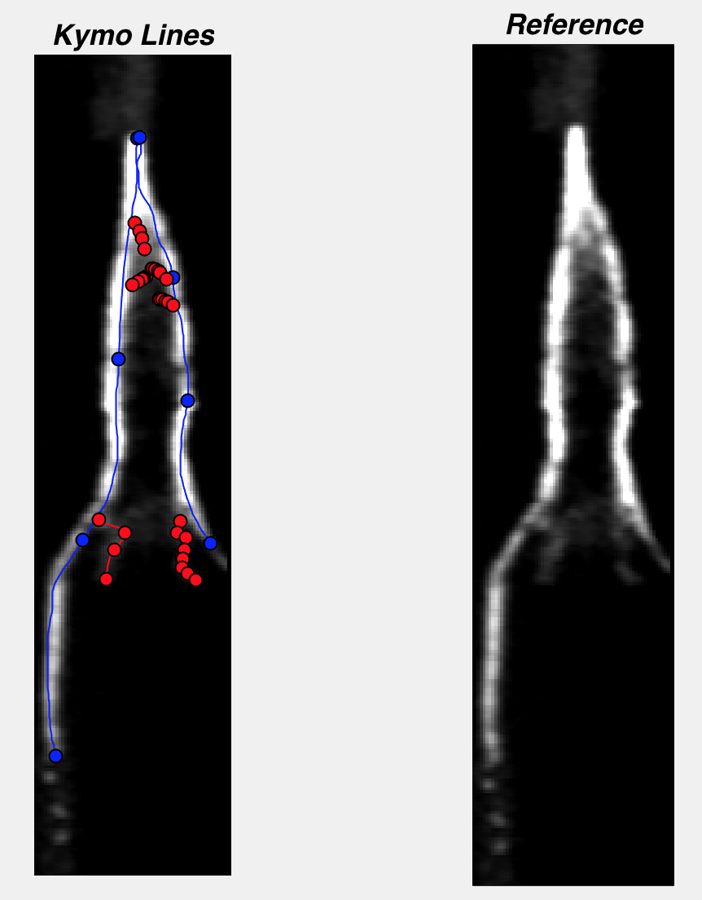
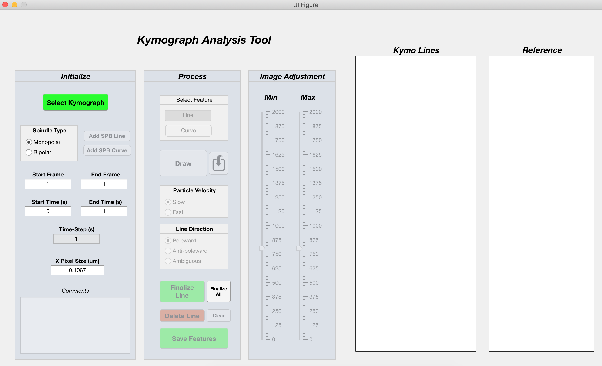

# KymoAnnotate

KymoAnnotate is a tool that allows users to draw tracks on kymographs for information extraction.

This is useful for analysis of protein movement in fluorescent microscopy.



## Prerequisites

Before you begin, ensure you have met the following requirements:
* You have installed `MATLAB` (this was tested on MATLAB 2019b).
* You have installed `git`.
* You have a `MacOS` machine (not tested on `Linux/Windows`).

## Installing KymoAnnotate

To install KymoAnnotate, follow these steps:

```
git clone https://github.com/saadjansari/KymoAnnotate.git
```


## Using KymoAnnotate

To run KymoAnnotate, double-click on `./KymoAnnotate.mlapp`

This should open the app which looks like this:


Please follow the demo video showing the app in action (preferred),

OR

Follow these instructions.

1. Load the kymograph .tiff file (Load button)
2. Adjust image contrast using the ‘Image Adjustment’ panel in the app. This helps to bring out the signal of the tracks.
3. Draw SPB tracks. First, select if this is a monopolar or a bipolar spindle (this sets the number of SPB curves to 1 or 2 respectively). Next, choose to draw either a line or a curve (spline) for the SPBs. Tracks can then be drawn directly on the kymograph by holding left-click and moving the mouse.
4. Draw cut7 tracks. Select if adding a line or a curve. Draw the track on the kymograph. If the user is happy with the drawn track, click ‘Finalize Track’. If the user is not happy, track can be clicked and deleted by hitting the ‘Delete Track’ button. Continue adding tracks until complete.
5. Finalization. To finalize all tracks, click ‘Finalize All’. Next, save tracks file by clicking ‘Save Results’. This creates a txt file saving the coordinate and intensity information of each drawn SPB and cut7 track.

Note that the saved tracks can be loaded back into KymoAnnotate for inspection and modification by using the load button in the app. 
Also note that we did not perform any fitting on the labeled tracks to bring them into the center of intensity. 
This meant that the user was solely responsible for the authenticity of the tracks drawn. 
The role of the app was to simply extract the requested information.


## Contributors

Thanks to the following people who have contributed to this project:

* [@saadjansari](https://github.com/saadjansari) 📖


## Contact

If you want to contact me you can reach me at saadjansari@gmail.com.

## License

This project uses the following license: [MIT](https://opensource.org/licenses/MIT).
